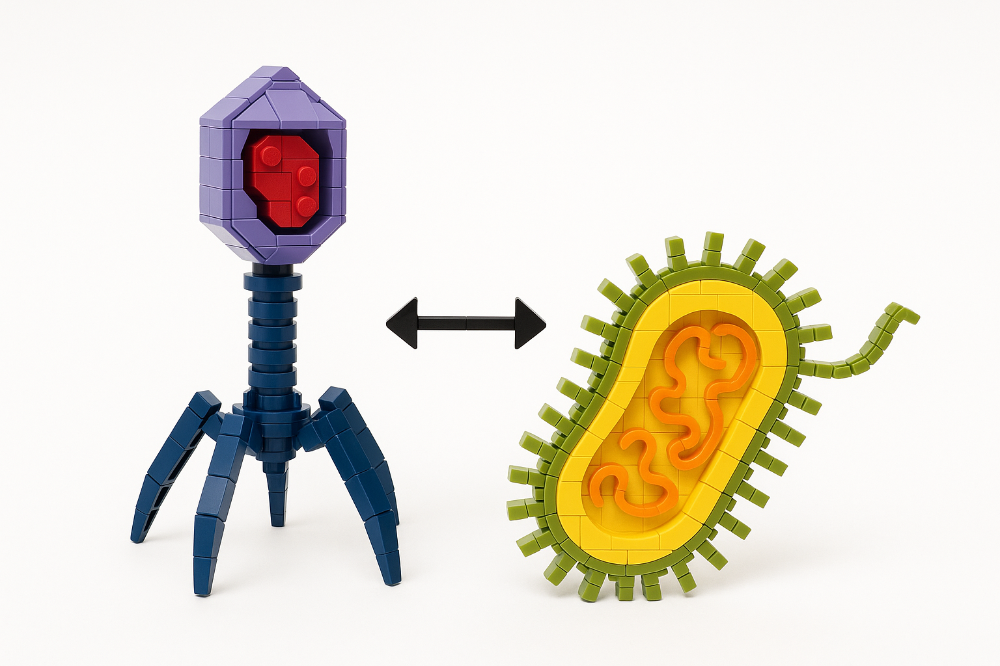
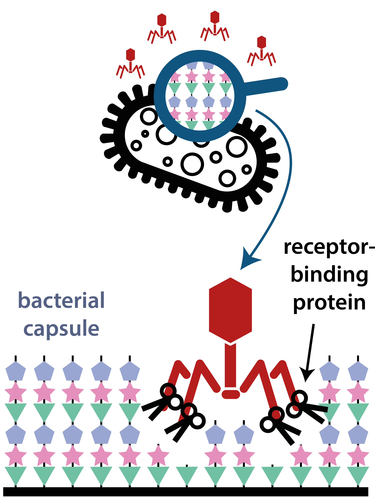
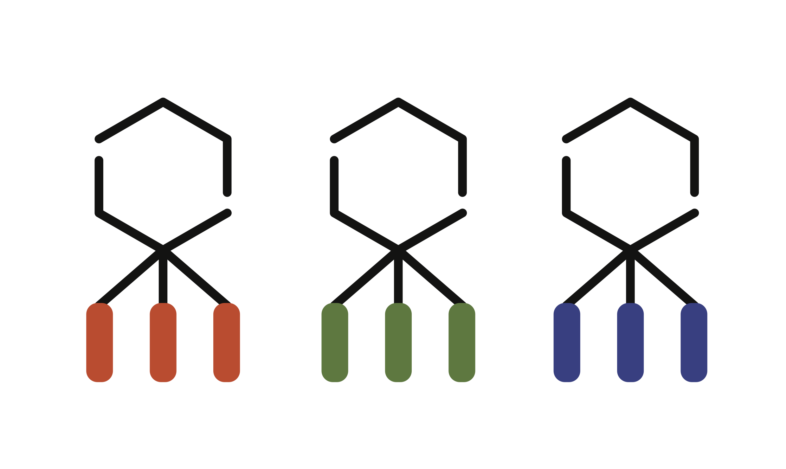

We are a **computational group** — we do not have a wet lab. 
Every project begins with code: genome sequences, protein structures, population data, and evolutionary models. 
Our experimental validation is done in close collaboration with partner labs.

Our research sits at the intersection of evolutionary biology, microbial genomics, and structural bioinformatics. 
We write Python and R every day. We do not pipette.

---

## The central question

How does **evolutionary innovation** work at the molecular scale in bacteriophages? 

Specifically: how do horizontal gene transfer and recombination generate new receptor-binding protein (RBP) functions, and can we predict — and ultimately design — those functions?

> "We are data scientists at heart — but in the scientific sense: we integrate multi-scale data (DNA, proteins, structures, metadata, populations, experimental results) to infer evolutionary processes and find novel patterns in complexity. We have intellectual ownership of our questions. We make direct predictions for experimental collaborators and interpret their results through an evolutionary lens."
>
> — Rafal Mostowy

---

## Model system: *Klebsiella pneumoniae* and its phages

*Klebsiella pneumoniae* carries a thick polysaccharide capsule — a key virulence factor and antibiotic-resistance enabler. Over 150 distinct capsular (K) types exist, each with a different surface chemistry.

Bacteriophages that infect *K. pneumoniae* deploy **receptor-binding proteins (RBPs)** equipped with depolymerase activity. These enzymes are highly specific: each RBP is tuned to recognise and degrade one (or a few) capsule types. That specificity is measurable, the genetic diversity is rich, and the clinical stakes — multidrug-resistant infections, phage therapy — are real.

This makes the *K. pneumoniae* phage system an ideal platform for studying evolutionary innovation computationally: specificity is measurable, recombination events are traceable, and our predictions can be tested by collaborators in the wet lab.

---

## Three knowledge gaps we are working on

Area 1 — Genetic &amp; structural diversity

What RBPs exist, and how diverse are they? We are building the first comprehensive catalogue of depolymerase-containing RBPs across *Klebsiella* phages — combining large-scale genome analysis with structural modelling (AlphaFold3) to map the genetic and structural landscape.

Area 2 — Functional diversity &amp; breadth

How does sequence and structure map to function? The relationship is more complex than assumed: many RBPs from temperate phages are inactive or have unexpectedly broad specificity. We use comparative genomics and machine learning to link genotype to phenotype, with experimental validation from our collaborators.

Area 3 — Adaptation via innovation

How does recombination at the domain and sub-domain level generate new functions? We develop new computational frameworks (including our ECF — Evolutionary Contour Fragments — approach) to detect recombination below the classical domain level, and link these events to functional changes in RBPs.

---

## Key published findings

### Protein domain shuffling drives RBP diversity
We analysed over 130,000 representative phage proteins and showed that domain mosaicism — the sharing of functional modules between otherwise unrelated proteins — is a major driver of diversity, with RBPs as a primary hotspot.  
**Smug et al., *Nature Communications* 2023.** [doi:10.1038/s41467-023-43236-9](https://doi.org/10.1038/s41467-023-43236-9)

### An ANI gap in bacterial dsDNA viruses
We developed MANIAC, a computational pipeline for accurate average nucleotide identity (ANI) estimation in mosaic viral genomes. Applied to large phage databases, it revealed a multimodal ANI distribution with a gap near 80% — analogous to the bacterial ANI gap, but shaped by viral-specific recombination dynamics.  
**Ndovie et al., *mSystems* 2025.** [doi:10.1128/msystems.01661-24](https://doi.org/10.1128/msystems.01661-24)

### Capsular specificity in temperate *Klebsiella* phages
Using a GWAS approach on prophage genomes, we identified diverse structural domains — pectin lyases and SGNH hydrolases — as the determinants of capsule-type specificity. Computational predictions were experimentally confirmed in collaboration with the Drulis-Kawa lab.  
**Otwinowska\*, Koszucki\* et al., *PLOS Biology* 2025.** [doi:10.1101/2025.06.25.661490](https://doi.org/10.1101/2025.06.25.661490)

---

## Longer-term vision

<figure class="vision-figure">
  
  <figcaption>The same phage scaffold, different receptor-binding proteins — each tuned to a distinct bacterial host.</figcaption>
</figure>

Our 10-year goal is a **predictive, mechanistic framework for RBP design** — grounded in evolutionary principles, not opaque algorithms.

**Short term (0–3 years):** Catalogue depolymerases for 30–50 *K. pneumoniae* K-types with experimental validation; establish preliminary design principles at the sub-domain level.

**Mid term (3–6 years):** Test the hypothesis that bacteria–phage interactions involve a broader enzymatic repertoire (acetyltransferases, SGNH hydrolases beyond canonical depolymerases); refine predictive models to link evolutionary events to function.

**Long term (6–10 years):** Rational design and proof-of-concept testing of engineered RBPs against clinical *K. pneumoniae* strains. Translational endpoint: phage therapy and synthetic biology.

---

## Foundational work: bacterial surface diversity

Our earlier work on bacterial polysaccharide evolution directly motivates the phage programme. Surface diversity in bacteria is the evolutionary pressure that drives phage innovation. Key papers:

- Holt & Mostowy (2020). Diversity and evolution of surface polysaccharide synthesis loci in Enterobacteriales. *ISME Journal* [→](https://doi.org/10.1038/s41396-020-0628-0)
- Mostowy & Holt (2018). Diversity-generating machines: genetics of bacterial sugar-coating. *Trends in Microbiology* [→](https://doi.org/10.1016/j.tim.2018.06.006)
- Mostowy et al. (2017). Pneumococcal capsule synthesis locus *cps* as evolutionary hotspot. *Molecular Biology and Evolution* [→](https://doi.org/10.1093/molbev/msx173)

---

## Collaborations

**National**

- Prof. Zuzanna Drulis-Kawa, University of Wrocław — experimental microbiology, validation of computational predictions
- Dr Stanisław Dunin-Horkawicz, University of Warsaw — computational structural biology

**International**

- Prof. Kathryn Holt, London School of Hygiene and Tropical Medicine — microbial systems genomics
- Prof. Eduardo Rocha, Institut Pasteur — evolutionary microbial genomics
- Prof. Ed Feil, University of Bath — evolution and ecology of microbial pathogens
